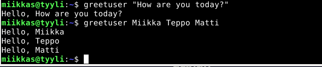

# h14 Tehtävä

## Kone

- MacBook Air(2015)
- Intel i5 1,6 GHz Dual-Core prossu
- 8 GB RAM
- macOS Monterey v.12.6.2

## a) Tee Linuxiin uusi komento Bashilla

- Tein kotihakemistooni ``scripts`` kansioon uuden tiedoston scriptiä varten 

      $ cd scripts/
      $ micro greetuser
      
- Tiedoston sisään bashilla kirjoitettu scripti:

      #!/usr/bin/bash
      
      for NAME in "$@"
      do 
          echo "Hello, $NAME"
      done
      
- #!/usr/bin/bash alkuun.
- Scripti lukee komentokehotteesta parametrin tai parametrit ja sijoittaa ne NAME objektiin, jonka jälkeen scripti tulostaa ``Hello, $NAME``. $NAME objekti tulostaa parametrin/parametrit.
- ``$@`` määrittelee parametrien sijoituksen.

- Seuraavaksi annoin tiedostolle oikeudet 
      
      $ chmod ugo+rx greetuser
      
- Eli tämä antaa seuraaville ryhmille oikeudet: (käyttäjä(user), ryhmä(group) ja muut(others))-
- Oikeudet, jotka annetaan ovat ``r``ja ``x``eli oikeus lukea(read) sekä suorittaa(execute) luomaani komentoa.

- Tämän jälkeen kopioin tiedoston oman kotihakemiston scripts kansiosta ``/user/local/bin/`` kansioon.
      
      $ sudo cp greetuser /usr/local/bin/
      
- Testataan komentoa omalla käyttäjällä:

- Ylemmässä testissä scripti tulostaa lauseen, koska parametri on kirjoitettu lainausmerkkien sisään: ``greetuser "..."``

Alemmassa testissä scripti tulostaa listana söytetyt parametrit, sillä ne eivät ole lainausmerkkien sisällä ja parametrit on eroteltu välilyönneillä.
- ``"$@"`` listaa nämä parametrit järjestyksessä.

- Testataan vielä toisella käyttäjällä:

Toimii!

## b) ja c) Tee Linuxiin uusi komento Pythonilla / Tee Linuxiin komento, joka tekee jotain monelle tiedostolle.

- Teen python komennon, joka listaa kaikkien tiedostojen tiedot esim. oikeudet ja koon kansiosta/teidostopolusta, jonka käyttäjä kirjoittaa komennon perään.

- Teen ensin simppelin komennon testatakseni, että se toimii.

- Uusi tiedosto ``scripts/`` tiedostoon:
      
      $ cd scripts/
      $ micro listrights
      
- ``listrights`` tiedoston sisään:
    
      import os
    
      cmd = 'ls -l'
    
      os.system(cmd)
    
- ``os`` on pythonin kirjasto. Otetaan se tiedostoon käyttöön ``import os``
- Määritellään komento muuttujaan ``cmd`` ja komento mitä halutaan suorittaa: ``'ls -l'``
- ``os.system()`` funktio mahdollistaa komentojen suorittamisen pythonin avulla. Komento määritellään funktiossa merkkijonona(string) eli luomassani scriptissä se on ``ls -l``. Funktio myös tulostaa vastauksen. ``system()`` funktio avaa käyttöjarjestelmän vastaavan komentokehotteen, jonka jälkeen komento suoritetaan sillä. 
      
- Testataan, että komento toimii

      $ python3 listrights
      

- Komento toimii. Komento siis toimii samalla tavalla kuin ``$ ls -l``, mutta komento toimii python scriptillä.

- Muokataan tiedostoa, jotta kaikki käyttäjät pystyvät käyttämään sitä pelkällä komennon nimellä.

      $ cd scripts
      $ micro listrights
      
      #!/usr/bin/python3  // Tämä siis lisätään tiedoston alkuun, muuten sama
      
      import os
      
      cmd = 'ls -l'
      
      os.system(cmd)
      
- Annetaan tiedostolle ``x``(execute) oikeudet ryhmille ``u``(user), ``g``(group) ja ``o``(others).
      
      $ chmod ugo+x listrights
      
- Kopioidaan komento ``/usr/local/bin`` kansioon
      
      $ sudo cp listrights /usr/local/bin/
      
- Testaan komentoa:

Tässä menin /usr/local/bin kansioon ja listasin sen sisällä olevien tiedostojen oikeudet 

- Muokataan tiedostoa siten, että komento ottaa parametrina käyttäjän syöttämän tiedostopolun, josta komento tulostaa tiedot kansiosta. Lisätään myös if lauseet, jos käyttäjä syöttää pelkän komennon niin tulostetaan käyttöohjeet tai jos tiedostopolku on väärä vastaa komento virheilmoituksella.

- Tiedostossa on otettu käyttöön nyt myös ``sys`` kirjasto. ``import sys``.
- Jos käyttäjä syöttää pelkästään komennon, komento tulostaa sen käyttöohjeet. ``if len(sys.argv) < 2``: len() funktio ottaa listan pituuden(sys.argv muodostaa listan), jos lista on pienempi kuin 2 tulostaa komento käyttöohjeet ja lopettaa scriptin.
- folder muuttuja määritelty = sys.argv[1]. Eli kansio haetaan sys.argv muodostamasta listasta sijalta [1].
- if not os.path.isdir(folder) funktio tarkastaa tiedostopolun. Jos funktio ei löydä tiedostoa se tulostaa ``{käyttäjän syöttämä polku} is not a directory``. ``.format(folder)`` lisää tulostukseen ``{}`` kohtaan käyttäjän syöttämän tiedostopolun. Tulostuksen jälkeen komento sulkeutuu(``sys.exit(1)``).
- ``cmd = ...`` määrittelee komennon. Tässä komento hakee kansiosta tiedostojen tiedot.
  - ``-lh`` näyttää listauksen teidostojen tiedoista, kuten oikeudet, koon, edellisen muokkauksen yms.
  - ``-a`` näyttää myös piilotetut teidostot eli ``.`` alkavat. 
  
Testataan vielä komentoa

Tässä testissä testasin hakea komennolla /usr kansion sekä testasin, että if lauseet toimivat. Ne vastaavat kuten odotin. Eli tulostaa käyttöhjeet, jos komennon syöttää tyhjänä ja jos polkua ei löydy tulostaa ohjelma "... is not valid directory" 

Testataan vielä toisellä käyttäjällä. Haetaan käyttäjän miikkas kotihakemisto:

Tämäkin toimii.

Lähteet:

Karvinen Tero 2023 h14 Uusi komento, Luettavissa: https://terokarvinen.com/2023/linux-palvelimet-2023-alkukevat/#h14-uusi-komento
